# Zlunix


A premium, enterprise-grade admin dashboard built with Flutter for managing CPA (Cost Per Action) networks. This platform provides a robust interface for administrators to manage offerwalls, track user activities, handle payouts, and analyze network performance.

---

## 🚀 Project Overview

The **Zlunix** admin dashboard is designed to be the central hub for CPA network owners. It offers a sophisticated suite of tools to manage every aspect of the business, from affiliate relations to complex payout systems. Built with scalability and maintainability in mind, it leverages **Clean Architecture** and the **MVI (Model-View-Intent)** pattern.

---

## 🛠 Tech Stack

Our tech stack is carefully curated to ensure maximum performance, developer productivity, and a seamless user experience:

*   **Framework:** [Flutter](https://flutter.dev/) (Web focus)
*   **Language:** [Dart](https://dart.dev/)
*   **State Management:** [Flutter BLoC/Cubit](https://pub.dev/packages/flutter_bloc) (Implementing MVI)
*   **Dependency Injection:** [GetIt](https://pub.dev/packages/get_it) & [Injectable](https://pub.dev/packages/injectable)
*   **Networking:** [Retrofit](https://pub.dev/packages/retrofit) & [Dio](https://pub.dev/packages/dio)
*   **Navigation:** [GoRouter](https://pub.dev/packages/go_router)
*   **Secure Storage:** [Flutter Secure Storage](https://pub.dev/packages/flutter_secure_storage)
*   **Responsiveness:** [Flutter ScreenUtil](https://pub.dev/packages/flutter_screenutil)
*   **Internationalization:** [Intl](https://pub.dev/packages/intl) (Multi-language support)
*   **Mapping & Models:** [Json Serializable](https://pub.dev/packages/json_serializable) & [Equatable](https://pub.dev/packages/equatable)

---

## 🏗 Architecture

The project strictly adheres to **Clean Architecture** principles and the **MVI pattern** to ensure separation of concerns and high testability.

### 1. Domain Layer (Pure Dart)
*   **Entities:** Core business objects.
*   **Use Cases:** Specific business logic/operations.
*   **Repository Interfaces:** Contracts for data operations.

### 2. Data Layer
*   **Models:** Data Transfer Objects (DTOs) with JSON mapping.
*   **Repository Implementations:** Logic for fetching and saving data.
*   **Data Sources:** Abstract interfaces for data operations.

### 3. API Layer (Network Implementation)
*   **Client:** Retrofit API clients and service definitions.
*   **DataSources Impl:** Concrete implementations of data sources using the API clients.
*   **Models/DTOs:** API-specific request and response models.
*   **Mappers:** Logic to transform API Models to Domain Entities.

### 4. Presentation Layer (MVI)
*   **ViewModel (Cubit):** Handles logic using a strict intent-based interface.
*   **State:** Immutable state objects using `Equatable`.
*   **Events/Intents:** Sealed classes defining user actions.
*   **Screens & Widgets:** UI components designed with SRP (Single Responsibility Principle).

---

## ✨ Features

-   **Dashboard:** Real-time analytics and statistics overview.
-   **Offerwall Management:** 
    -   Dynamic Offerwall Aggregator.
    -   Integration with top providers (CPX Research, Monlix, Lootably, etc.).
-   **User Management:** Detailed user profiles, activity tracking, and country-based filtering.
-   **Payout System:** 
    -   Manage payout options and methods.
    -   Approve/Reject user payout requests.
-   **Tracker:** Advanced tracking system for conversion and traffic analysis.
-   **Affiliate Management:** Manage affiliate networks and their configurations.
-   **Notifications:** System-wide notifications for administrators.
-   **Localization:** Fully localized interface supporting multiple languages.

---

## 📂 Folder Structure

```text
lib/
├── api/             # Network clients and API definitions
├── core/            # Shared logic (DI, Theme, Utils, Router)
├── data/            # Data layer (Models, Repositories Impl, DataSources)
├── domain/          # Domain layer (Entities, UseCases, Repository Interfaces)
├── generated/       # Code generated by build_runner (Intl, etc.)
├── l10n/            # Localization files (.arb)
├── presentation/    # UI layer (Screens, Widgets, ViewModels)
│   ├── auth/        # Authentication feature
│   ├── dashboard/   # Main dashboard feature
│   ├── user/        # User management feature
│   └── ...          # Other feature modules
└── main.dart        # Entry point
```

---

## 🚀 How to Run the Project

Follow these steps to get the project running locally:

1.  **Clone the repository:**
    ```bash
    git clone https://github.com/youssefmdev22/cpa_admin_website.git
    ```
2.  **Install dependencies:**
    ```bash
    flutter pub get
    ```
3.  **Generate files (Injectable, Retrofit, etc.):**
    ```bash
    dart run build_runner build --delete-conflicting-outputs
    ```
4.  **Run the application:**
    ```bash
    flutter run -d chrome
    ```

---

## 📸 Screenshots

<details>
<summary><b>🖥️ Dashboard & Overview</b></summary>

| Dashboard | Users |
| :---: | :---: |
| 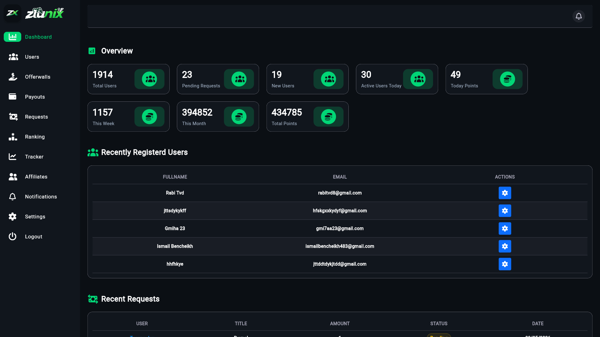 | 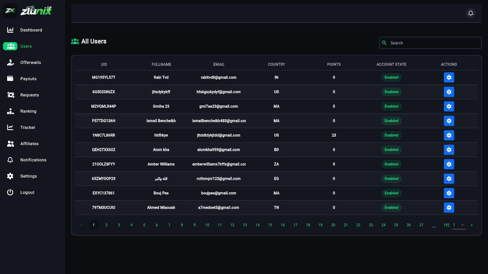 |

</details>

<details>
<summary><b>🛠️ Management & Forms</b></summary>

| Add Offerwall | Add Payout |
| :---: | :---: |
| 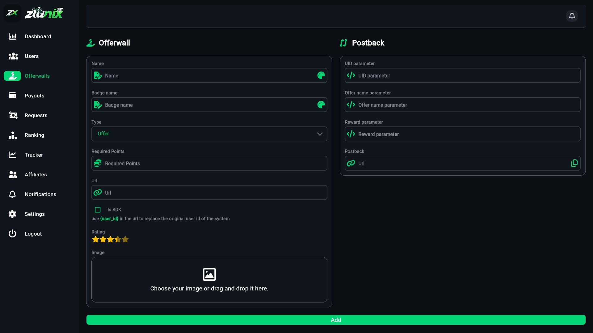 | 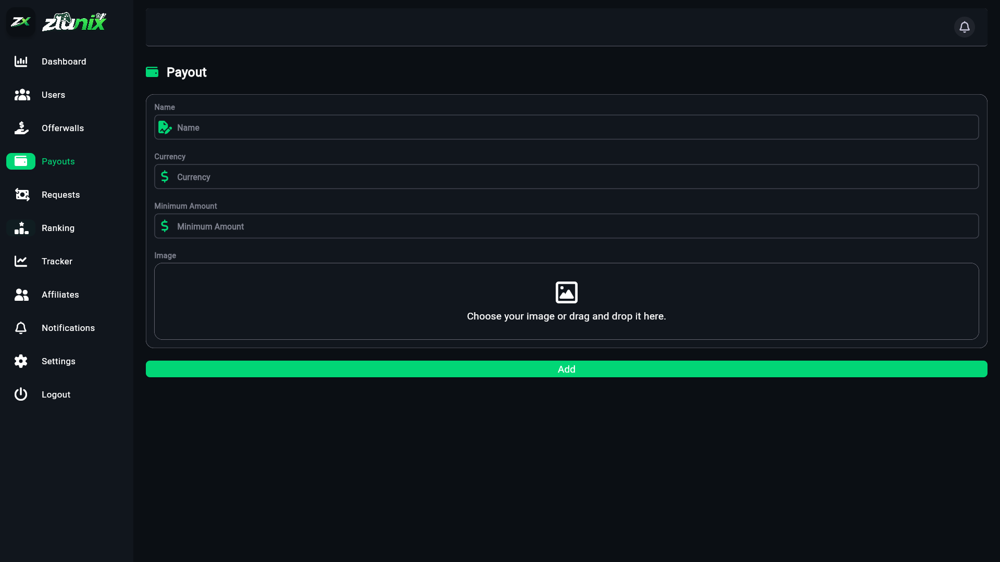 |

| Add Payout Option | Payout Option |
| :---: | :---: |
| 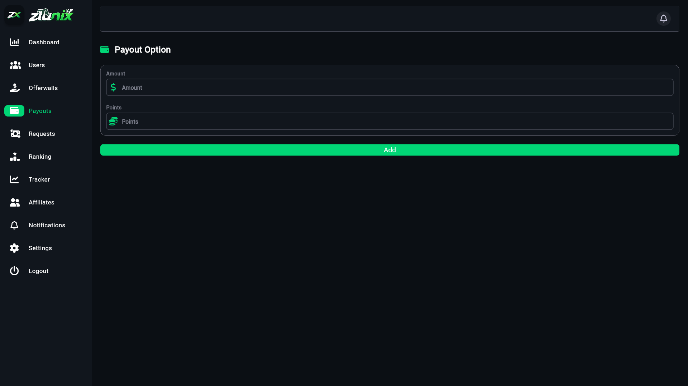 | 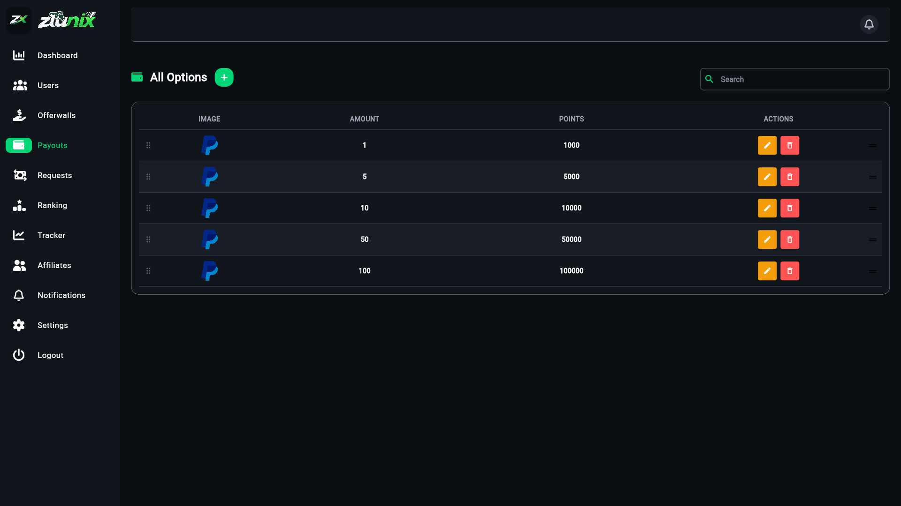 |

</details>

<details>
<summary><b>📊 Lists & Data</b></summary>

| Payouts | Offerwalls |
| :---: | :---: |
| 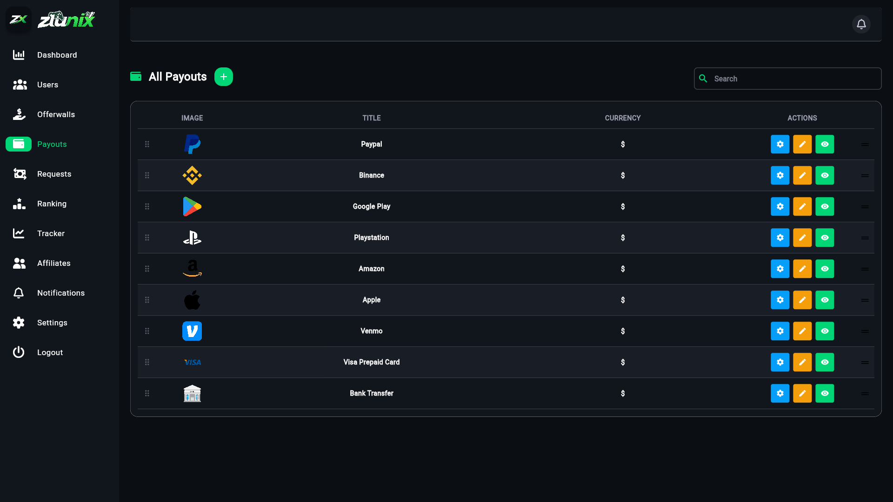 | 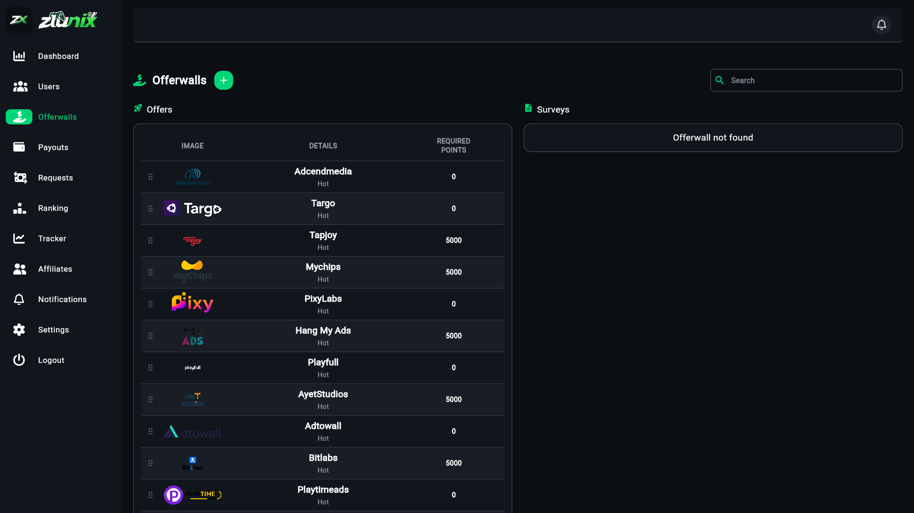 |

| Affiliates | Ranking |
| :---: | :---: |
| 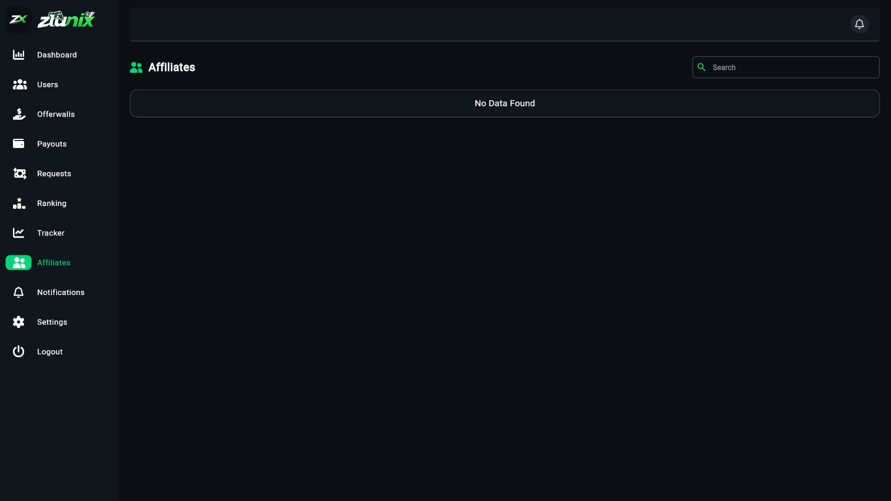 | 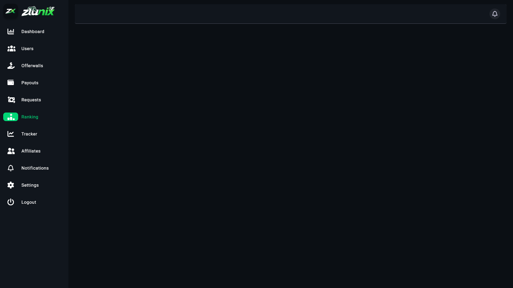 |

| Requests | Tracker |
| :---: | :---: |
| 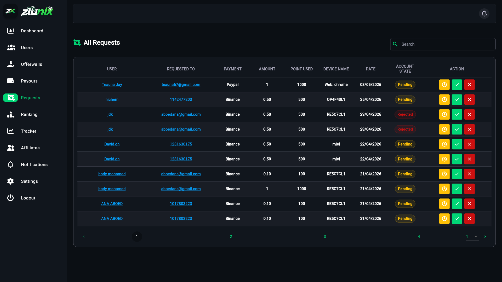 | 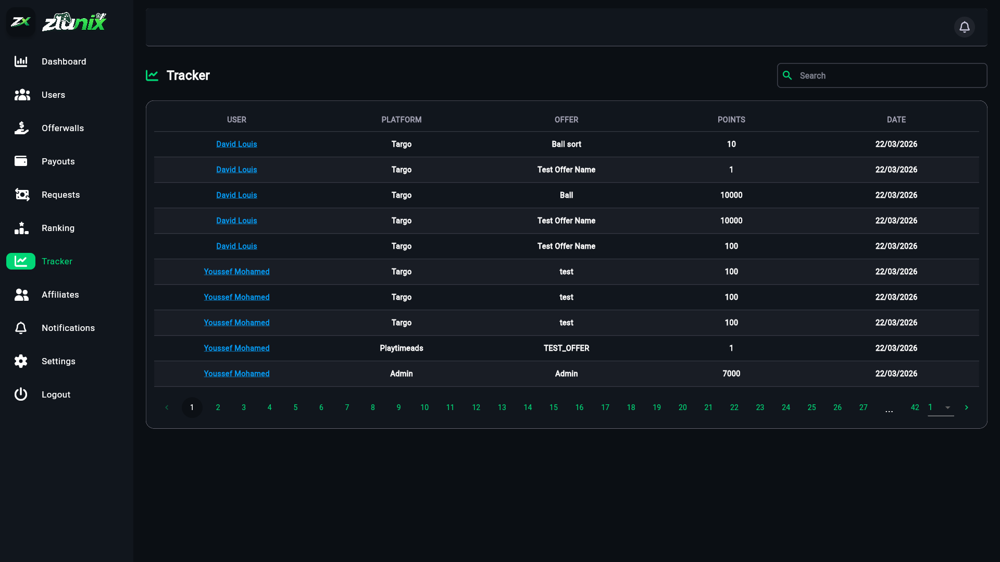 |

</details>

<details>
<summary><b>👤 User & System</b></summary>

| User Profile | Settings |
| :---: | :---: |
| 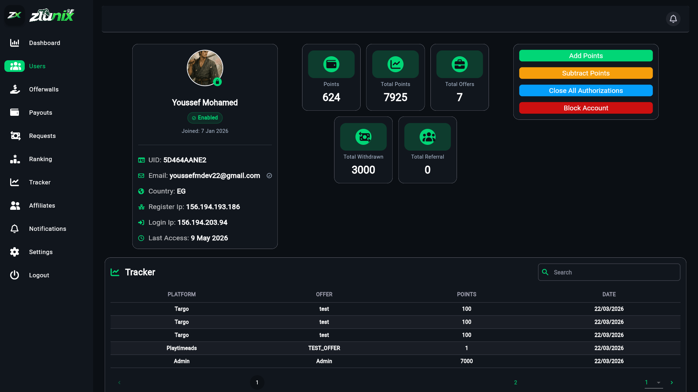 | 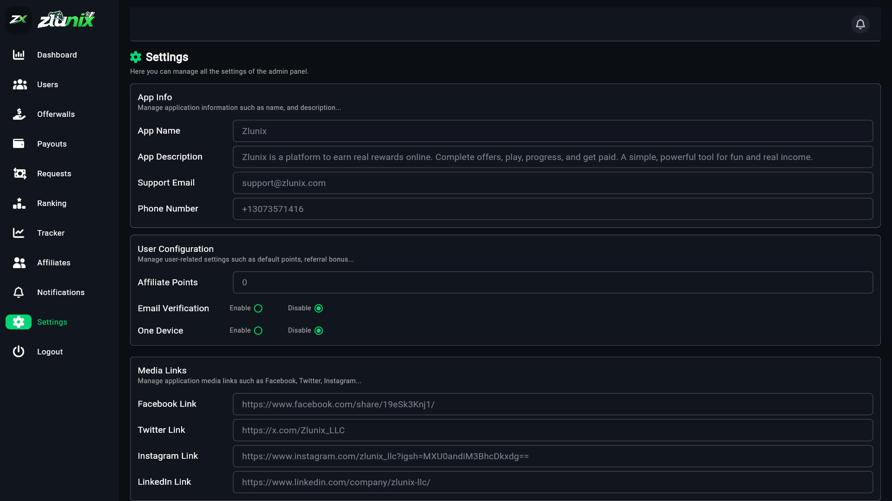 |

| Login | Notifications |
| :---: | :---: |
| 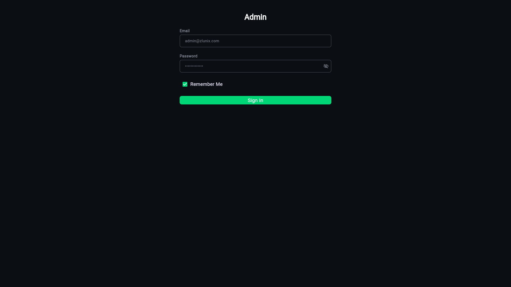 | 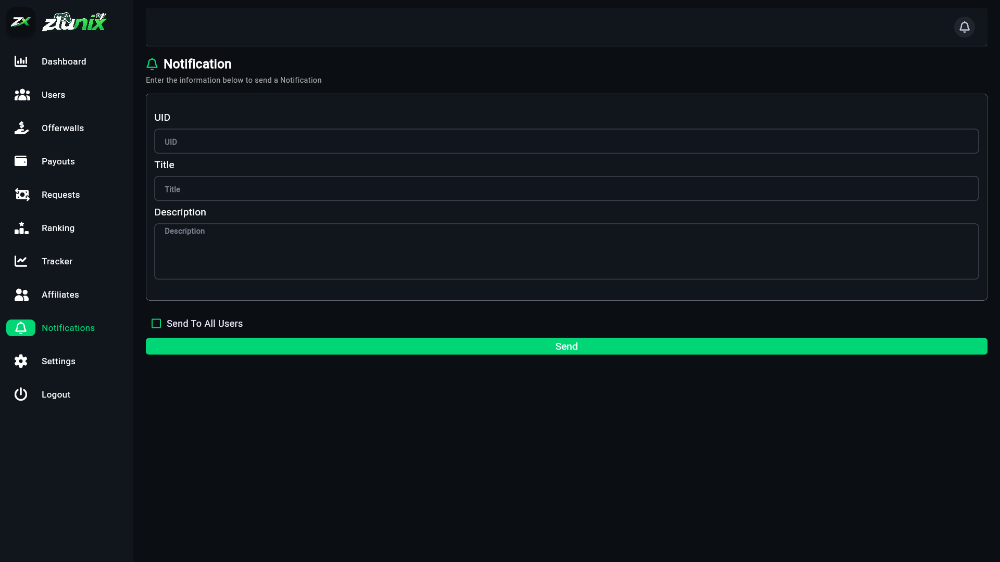 |

</details>

---

## 🤝 Social Links

-   **GitHub:** [@youssefmdev22](https://github.com/youssefmdev22)
-   **LinkedIn:** [Your Name](https://www.linkedin.com/in/your-profile)
-   **Website:** [yourwebsite.com](https://yourwebsite.com)

---

Built with ❤️ by the **Flutter**.
